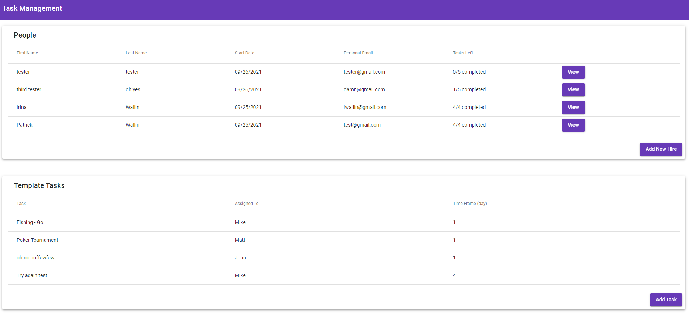

# Task Management Project
This is an Angular 'Task Management' project that is building in Angular.  It would show the list of people and template tasks while this web application has the following functionality:
- View listing of template tasks per person
- Add New Hire
- Add Task
- Change status of each task per person
- Update 'Tasks Left' based on status
- Sort the list of people (when all tasks of each person is completed or not application, it goes to the bottom. )



## Table of Contents
* [Technologies](#technologies)
* [Install dependencies](#install-dependencies)
* [Start Server](#start-server)
* [Contact](#contact)

## Technologies 
- TypeScript
- NPM
- NodeJS
- Angular

## Install dependencies
Clone this repository and open your terminal and go to the root of the directory of this project.
Then execute the following at your command or terminal:
```
npm install
```

## Start server
Open your terminal and go to the root of the directory of this project.
Then run the following at your command or terminal:
```
ng serve
```

It will run the web application at http://localhost:4200.  Please go to the browser and type it in the address. It should show as the screenshot above.

## Contact
Created by [Patrick Wallin](https://www.linkedin.com/in/patrick-wallin) - feel free to contact me!
